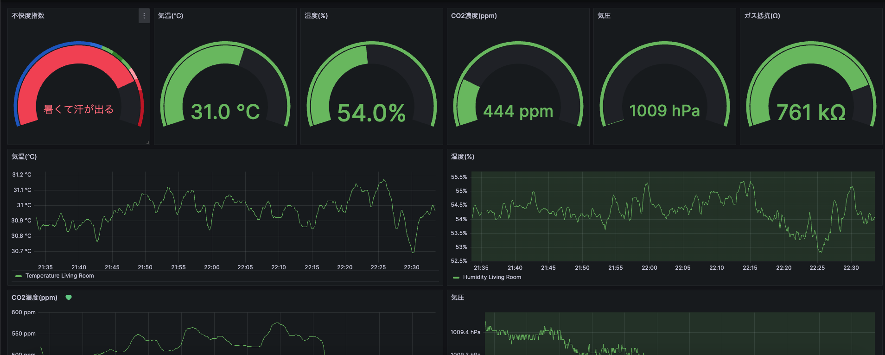

# my-room-sensor

This is a simple project to read temperature, humidity, air pressure, gas resistance and co2 density from a BME680 sensor and a MH-Z19C sensor and send the data to InfluxDB.
The data is then visualized during a Grafana dashboard.


# Requirements

## Hardware

- Raspberry Pi 4B
- BME680 sensor
- MH-Z19C sensor

## Software

Applications are run in Docker containers. The following software is required:

- Docker
- Docker compose

Applications are as follows:

- InfluxDB(container name is db)
- Grafana(grafana)
- Sensor data collector(sensor, coded in Rust)

# Installation

These instructions are for a Raspberry Pi running Raspbian OS.

1. Clone the repository
   ```bash
   git clone https://github.com/Penpen7/my-room-sensor
   ```
2. Change directory
   ```bash
   cd my-room-sensor
   ```
3. Enable I2C interface and Serial interface on Raspberry Pi
   ```bash
   sudo raspi-config
   ```
   - Select `Interface Options`
   - Select `I2C` and enable it
   - Select `Interface Options`
   - Select `Serial` and enable it
   - Reboot the Raspberry Pi
   - Check if the I2C and Serial interfaces are enabled
     ```bash
     i2cdetect -y 1
     ls -l /dev/ttyS0
     ```
4. Create containers by running the following command
   ```bash
   docker-compose up
   ```
5. Access Grafana by opening a web browser and going to `http://localhost:3000` or http://raspberrypi.local/.
6. Check if the data is being collected by watching the logs of the sensor data collector and Grafana.
7. If you want to stop the containers, run the following command
   ```bash
   docker-compose down
   ```
8. If you want to create a systemd service to start the containers automatically when the Raspberry Pi is booted, run the following command

   - Create a systemd service file (my-room-sensor.service)

     ```plaintext
     [Unit]
     Description=managed by docker-compose
     Requires=docker.service

     [Service]
     Type=simple

     WorkingDirectory=/home/naoki/docker-grafana
     ExecStart=/usr/bin/docker compose up --abort-on-container-exit
     ExecStop=/usr/bin/docker compose stop
     TimeoutStartSec=10min
     Restart=always
     RestartSec=10s
     User=naoki

     [Install]
     WantedBy=multi-user.target
     ```

   - Copy the systemd service file to the systemd directory
     ```bash
     sudo cp my-room-sensor.service /etc/systemd/system/
     sudo systemctl daemon-reload
     sudo systemctl enable my-room-sensor
     sudo systemctl start my-room-sensor
     ```

# Development

Even if you don't have the hardware, you can develop the sensor data collector on your local machine.

1. Clone the repository
   ```bash
   git clone https://github.com/Penpen7/my-room-sensor
   ```
2. Change directory
   ```bash
   cd my-room-sensor
   ```
3. Create containers by running the following command
   ```bash
   docker-compose -f compose_dev.yml up
   ```
4. Access Grafana by opening a web browser and going to `http://localhost:3000`.
5. You can edit the source code of the sensor data collector in the `sensor` directory and the changes will be reflected in the container.
6. If you apply the changes to Raspberry Pi, you can build the source code by running the following command
   - Build the source code
   ```bash
   cd sensor
   ./build.sh
   ```
   - Copy the binary(sensor/my-room-sensor) to the Raspberry Pi

# References

- [電子工作初心者が Raspberry Pi 4B で温度・湿度・気圧・二酸化炭素濃度を計測して Ambient に送信してみる](https://blog.u-naoki.com/posts/rpi-4b-measure-env-data-send-ambient/)
